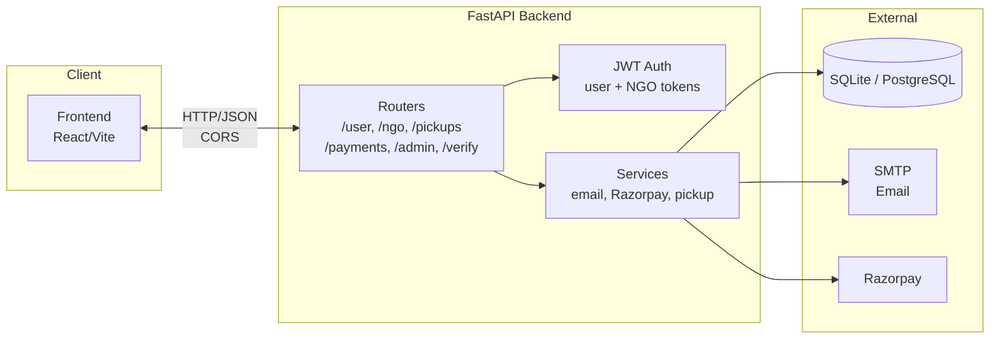
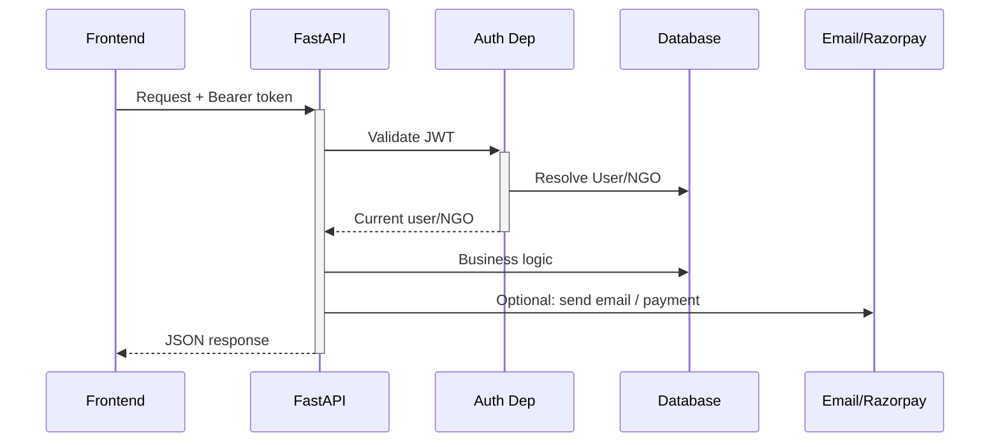
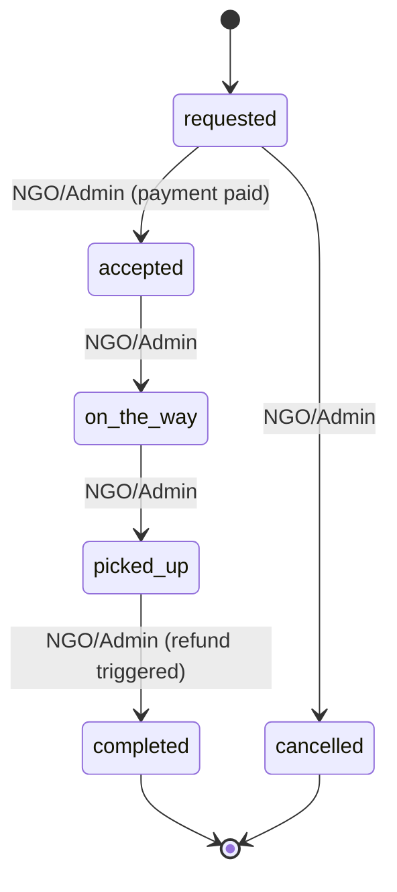
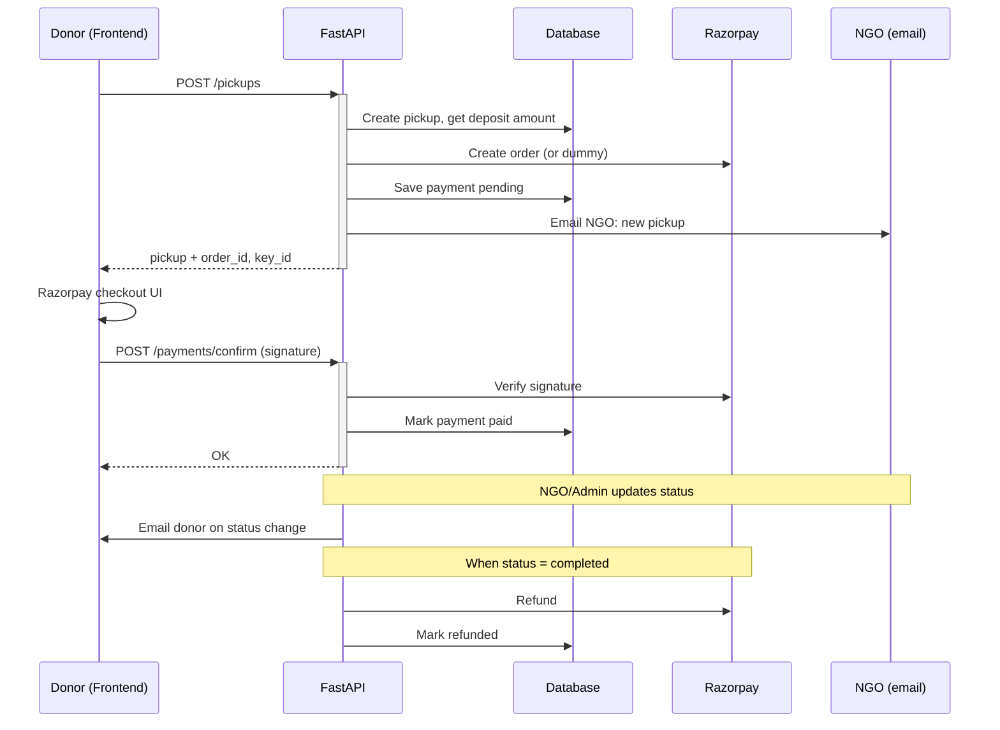

# System Design

This document describes the high-level architecture and design of the **Donation OpenHand** backend.

## Purpose

The backend powers a donation platform where:

- **Donors** (users) register, verify their email, and create pickup requests for donations to chosen NGOs.
- **NGOs** register, verify email, get approved by an admin, then accept and manage pickups.
- **Admins** manage users, approve/reject NGOs, configure deposit amount, and view dashboard stats.
- A **deposit** (refundable) is held via Razorpay when a pickup is created; it is refunded when the pickup is completed.

## Architecture Overview

**Request flow (high level):**

## Components

| Component | Location | Responsibility |
|-----------|----------|----------------|
| **FastAPI app** | `app/main.py` | CORS, router mounting, DB table creation on startup |
| **User API** | `app/api/user.py` | Signup, login, profile, change-password, delete; email verification |
| **NGO API** | `app/api/ngo.py` | NGO register, login, list verified NGOs, profile |
| **Pickups API** | `app/api/pickups.py` | Create pickup, list/get, update status (NGO/Admin); deposit order creation |
| **Payments API** | `app/api/payments.py` | Confirm payment (Razorpay signature), get payment by pickup, webhook |
| **Admin API** | `app/api/admin.py` | Users/NGOs/pickups CRUD, config (deposit amount), dashboard stats |
| **Verify API** | `app/api/verify.py` | Unified email verification (donor + NGO); notifies admin on NGO verify |
| **Auth** | `app/dependencies/auth.py` | Resolve JWT to User or NGO; role checks |
| **Authentication service** | `app/services/authentication.py` | Password hashing (Argon2), JWT create/verify |
| **Email service** | `app/services/send_email.py` | Verification, pickup request to NGO, status to donor, NGO approval, new NGO to admin |
| **Razorpay service** | `app/services/razorpay_service.py` | Create order, verify signature, refund (optional; dummy flow when not configured) |
| **Pickup service** | `app/services/pickup_service.py` | Deposit amount from config, status transitions, status history, response builder |
| **Database** | `app/db/connection.py` | Engine, session, create tables, migrations/seeds (admin, test NGOs) |

## Key Flows

### 1. Donor signup and login

1. Donor signs up → user created, verification token stored, verification email sent (background).
2. Donor clicks link → `GET /verify/verify?token=...` (or frontend uses token) → user marked verified.
3. Donor logs in → `POST /user/login` → JWT with `user_id` returned; email must be verified.

### 2. NGO registration and approval

1. NGO registers → NGO created, verification token stored, verification email sent.
2. NGO clicks link → verify endpoint clears token; **NGO remains unverified**; admin is notified by email.
3. Admin approves → `PATCH /admin/ngos/{ngo_id}` with `is_verified: true` → NGO can log in; approval email sent to NGO.

### 3. Pickup lifecycle

1. Donor creates pickup → `POST /pickups` (donor or admin) → Pickup + Razorpay order (or dummy order) created; NGO notified by email.
2. Donor pays deposit (if Razorpay used) → frontend calls Razorpay; then `POST /payments/confirm` with signature.
3. NGO/Admin updates status: `requested` → `accepted` (only if payment is paid) → `on_the_way` → `picked_up` → `completed`. Donor is emailed on status change.
4. On `completed`, backend triggers refund (Razorpay or dummy); payment and pickup marked refunded.

**End-to-end sequence (donor creates → pays → NGO completes → refund):**

### 4. Admin

- Dashboard: `GET /admin/dashboard` → counts (users, NGOs, pending NGOs, pickups, requested pickups, active deposits).
- Config: `GET/PUT /admin/config` → deposit amount in paise.
- Users: list/update; NGOs: list/update/delete; Pickups: list/get.

## Technology Stack

- **Framework:** FastAPI
- **ORM/DB:** SQLModel (SQLAlchemy), SQLite (default) or PostgreSQL via `DATABASE_URL`
- **Auth:** JWT (PyJWT), Argon2 for passwords
- **Email:** fastapi-mail, SMTP (e.g. Gmail with App Password)
- **Payments:** Razorpay (optional; dummy orders when not configured)
- **Config:** python-dotenv, environment variables

## Design Decisions

- **Separate JWT for User vs NGO:** Tokens carry either `user_id` or `ngo_id` so one dependency can resolve “current user” or “current NGO” for different routes.
- **Unified verification endpoint:** One `/verify/verify` handles both donor and NGO tokens (payload `type` distinguishes).
- **Deposit in paise:** Stored and communicated in paise (e.g. 10000 = ₹100); config key `deposit_amount_paise` in `admin_config`.
- **Status machine:** Pickup status transitions are enforced in `pickup_service` via `ALLOWED_TRANSITIONS` (e.g. requested → accepted or cancelled only).
- **Background emails:** Email sending is offloaded to FastAPI `BackgroundTasks` so API responses are not blocked by SMTP.
