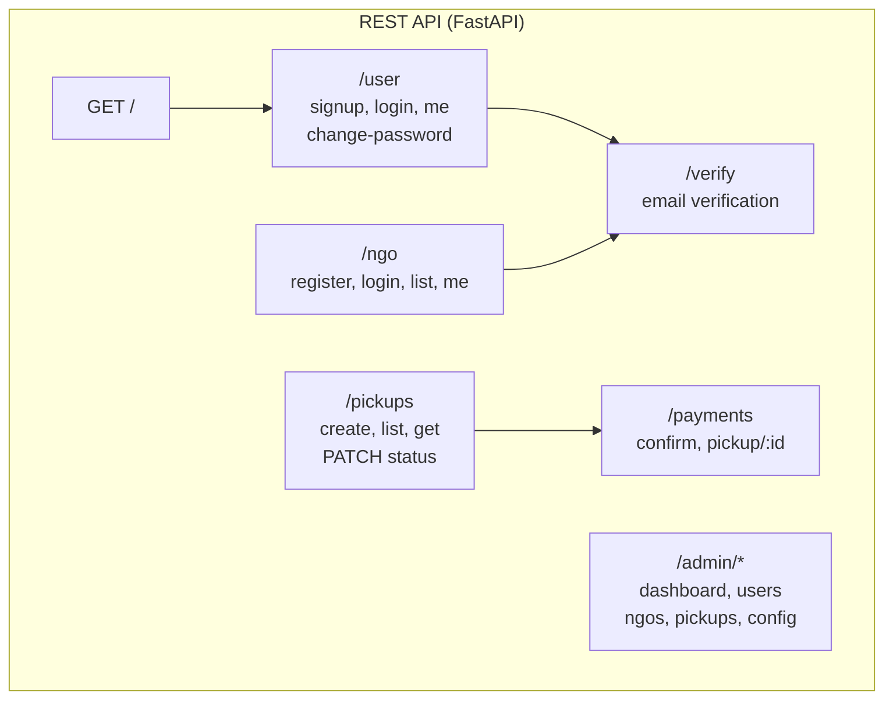

# API Design

This document describes the REST API exposed by the Donation OpenHand backend. Base URL: `/` (e.g. `http://localhost:8000`). All authenticated endpoints expect `Authorization: Bearer <token>` unless noted.

## API Overview

---

## Root

| Method | Path | Auth | Description |
|--------|------|------|-------------|
| GET | `/` | No | Health check; returns `{"message": "Server is running for Donation OpenHand"}` |

---

## User (`/user`)

Tag: **User Authentication**

| Method | Path | Auth | Description |
|--------|------|------|-------------|
| GET | `/user/me` | User | Current user profile |
| POST | `/user/signup` | No | Register new user; sends verification email |
| POST | `/user/login` | No | Login; returns JWT + user (email must be verified) |
| GET | `/user/verify` | No | Verify user email by token (query: `token`). Alternative: use unified `/verify/verify` for both user and NGO. |
| POST | `/user/change-password` | User | Change password (current + new) |
| DELETE | `/user/delete` | No | Delete user by email (query: `email`) |

### Request/Response Examples

**POST /user/signup**  
Body: `{ "fname", "lname", "email", "contact_number", "password", "location", "gender", "role", "dob?" }`  
- `role`: `"donor"` \| `"admin"`  
- `contact_number`: 10 digits  
- Response: `{ "message", "user_id", "email" }`

**POST /user/login**  
Body: `{ "email", "password" }`  
Response: `{ "access_token", "token_type": "bearer", "user": { "user_id", "fname", "lname", "email", "contact_number", "location", "gender", "role", "is_verified" } }`

---

## NGO (`/ngo`)

Tag: **NGO Registration**

| Method | Path | Auth | Description |
|--------|------|------|-------------|
| GET | `/ngo/me` | NGO | Current NGO profile (no password) |
| GET | `/ngo/list` | No | List verified NGOs (for donor dropdown) |
| POST | `/ngo/register` | No | Register NGO; sends verification email |
| POST | `/ngo/login` | No | NGO login; returns JWT (NGO must be verified by admin) |

### Request/Response

**POST /ngo/register**  
Body: `NGOCreate`: `ngo_name`, `registration_number`, `ngo_type` (trust/society/section8), `email`, `website_url?`, `address`, `city`, `state`, `pincode`, `mission_statement`, `bank_name`, `account_number`, `ifsc_code`, `password`.  
Response: NGO object (including `ngo_id`, no password in response).

**GET /ngo/list**  
Response: `[{ "ngo_id", "ngo_name", "city", "state" }, ...]`

---

## Pickups (`/pickups`)

Tag: **Pickups**

| Method | Path | Auth | Description |
|--------|------|------|-------------|
| POST | `/pickups` | Donor or Admin | Create pickup; creates deposit order; emails NGO |
| GET | `/pickups` | User or NGO | List pickups (filtered by role; optional `?status=`) |
| GET | `/pickups/{pickup_id}` | User or NGO | Get pickup detail with status history |
| PATCH | `/pickups/{pickup_id}/status` | NGO or Admin | Update status (and optional note); on completed, triggers refund |

### Request/Response

**POST /pickups**  
Body: `{ "ngo_id", "pickup_address", "scheduled_time?", "items_description?" }`  
Response: `{ "pickup": pickup_detail, "payment": { "order_id", "amount", "currency", "status", "key_id?" } }`  
- If Razorpay not configured: dummy order, `status: "paid"`.  
- Otherwise: `order_id` and `key_id` for frontend checkout.

**PATCH /pickups/{id}/status**  
Body: `{ "status": "requested"|"accepted"|"on_the_way"|"picked_up"|"completed"|"cancelled", "note?" }`  
- Valid transitions enforced (e.g. `requested` → `accepted` or `cancelled` only).  
- `accepted` allowed only if payment is paid.

---

## Payments (`/payments`)

Tag: **Payments**

| Method | Path | Auth | Description |
|--------|------|------|-------------|
| POST | `/payments/confirm` | User (donor) | Verify Razorpay signature and mark payment paid |
| GET | `/payments/pickup/{pickup_id}` | User/NGO/Admin | Get payment for a pickup |
| POST | `/payments/webhook/razorpay` | Webhook secret | Razorpay webhook (payment.captured, refund.*) |

### Request/Response

**POST /payments/confirm**  
Body: `{ "pickup_id", "razorpay_order_id", "razorpay_payment_id", "razorpay_signature" }`  
Response: Payment object (id, pickup_id, amounts, status, timestamps).

**GET /payments/pickup/{pickup_id}**  
Response: `{ "pickup_id", "payment": {...} | null, "payment_status" }`

---

## Admin (`/admin`)

Tag: **Admin**  
All admin endpoints require **User** with role **admin**.

| Method | Path | Description |
|--------|------|-------------|
| GET | `/admin/users` | List users (optional: `?role=`, `?search=`, `?is_active=`) |
| PATCH | `/admin/users/{user_id}` | Update user (`role?`, `is_active?`) |
| GET | `/admin/ngos` | List NGOs (optional: `?is_verified=`) |
| PATCH | `/admin/ngos/{ngo_id}` | Approve/reject NGO (`is_verified`); sends email to NGO |
| DELETE | `/admin/ngos/{ngo_id}` | Delete NGO and related pickups/payments/history |
| GET | `/admin/pickups` | List all pickups (optional: `?status=`) |
| GET | `/admin/pickups/{pickup_id}` | Get pickup detail |
| GET | `/admin/config` | Get config (e.g. `deposit_amount_paise`) |
| PUT | `/admin/config` | Update config (`deposit_amount_paise?`) |
| GET | `/admin/dashboard` | Dashboard counts (users, NGOs, pending, pickups, deposits) |

---

## Verification (`/verify`)

Tag: **Verification**

| Method | Path | Auth | Description |
|--------|------|------|-------------|
| GET | `/verify/verify` | No | Unified email verification; query: `token` |

- If token is **user** verification: sets user `is_verified`, clears token.  
- If token is **NGO** verification: clears token only (NGO stays pending); notifies admin.  
Response varies: `{ "message", "pending_admin_approval"? }`.

---

## Error Responses

- **400** Bad Request: validation or business rule (e.g. invalid status transition).  
- **401** Unauthorized: missing/invalid token.  
- **403** Forbidden: wrong role or not allowed to access resource.  
- **404** Not Found: entity not found.  
- **500** Internal Server Error: unexpected failure.

Detail is in JSON: `{ "detail": "..." }` (string or list of errors).

---

## CORS

Allowed origins include `http://localhost:5173`, `http://localhost:3000`, and `127.0.0.1` variants. Credentials, all methods, and headers are allowed.
