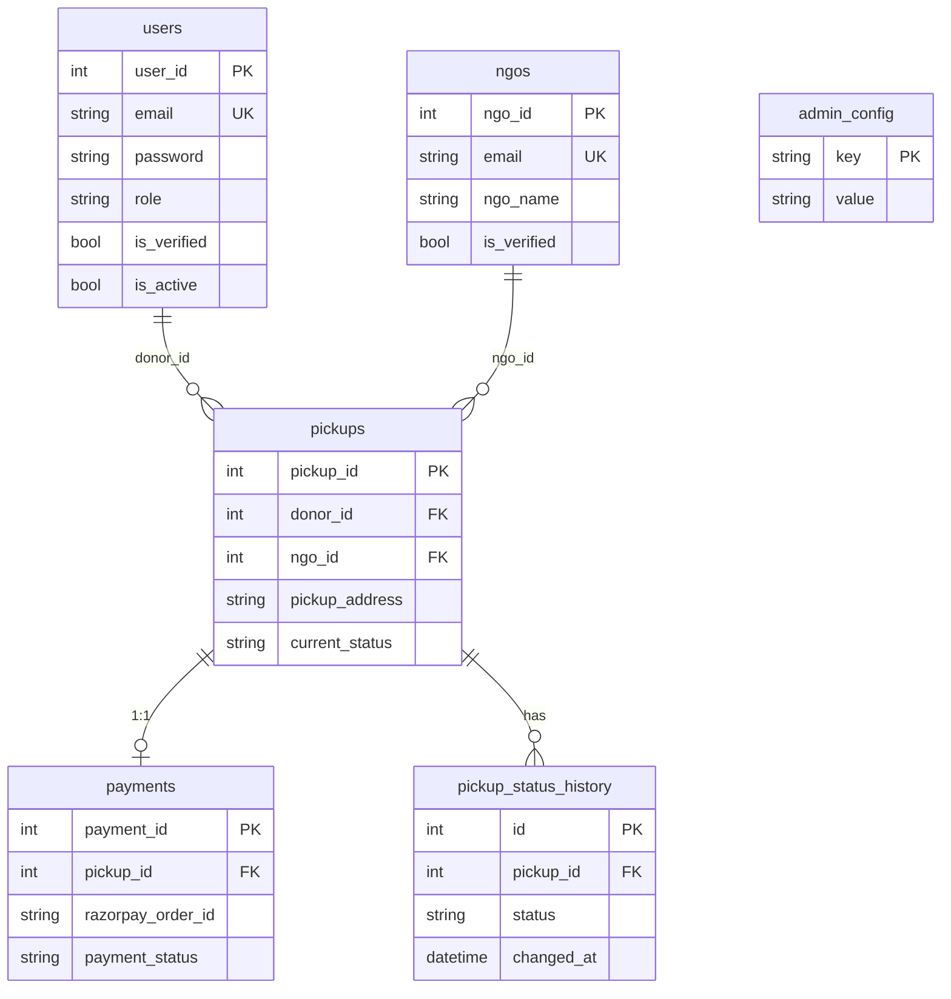
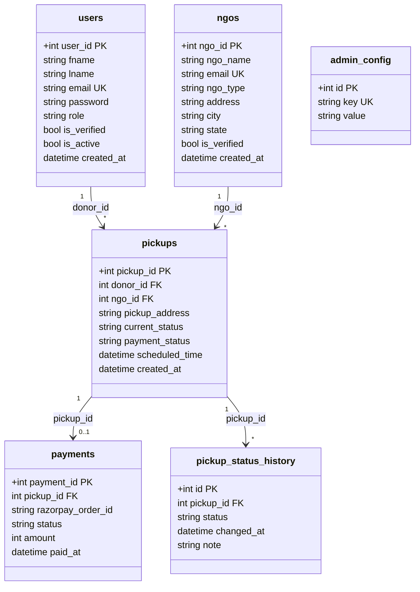
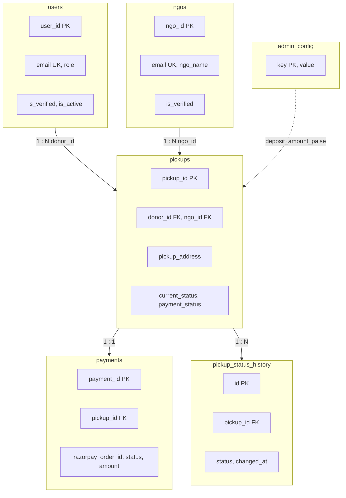
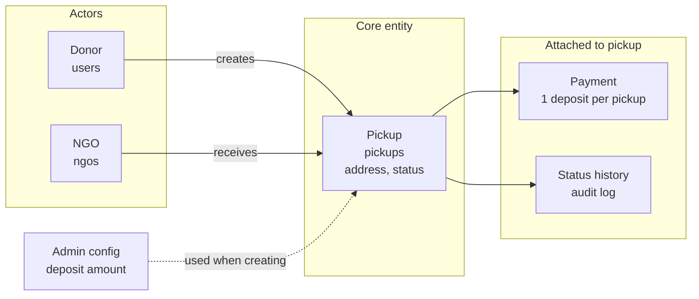
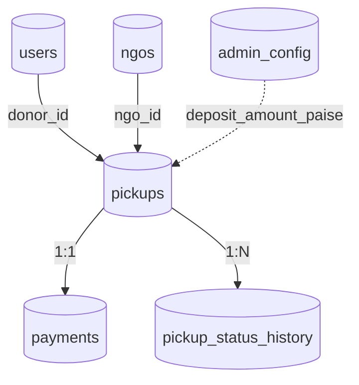

# Data Model Design

This document describes the database schema and entity relationships used by the Donation OpenHand backend. The ORM is **SQLModel** (SQLAlchemy); the default database is **SQLite** (configurable via `DATABASE_URL`).

---

## Entity Relationship Overview

The same data model is shown in **five different visual styles** below. Use the one that fits how you think (ER, UML, box layout, domain story, or compact flow).

| View | Best for |
|------|----------|
| **1. ER diagram** | Classic entity-relationship with cardinality (one-to-many, etc.). |
| **2. UML class diagram** | Table-as-class with main fields and relationship multiplicity. |
| **3. Visual schema** | Tables as boxes with key columns; FK arrows with labels. |
| **4. Simplified domain** | High-level: Donor/NGO → Pickup → Payment/History. |
| **5. Relationship flow** | Minimal: table names and FK arrows only. |

### View 1: ER diagram (tables and cardinality)

### View 2: UML-style class diagram

### View 3: Visual schema (tables as boxes, relationships with labels)

### View 4: Simplified domain (concepts and flow)

### View 5: Relationship flow (compact)

---

## Tables and Fields

### 1. `users`

Stores donors and admin users. NGOs are in `ngos`, not here.

| Column | Type | Constraints | Description |
|--------|------|--------------|-------------|
| user_id | INTEGER | PK, auto | Primary key |
| fname | VARCHAR | NOT NULL | First name |
| lname | VARCHAR | NOT NULL | Last name |
| email | VARCHAR | UNIQUE, NOT NULL, indexed | Login identifier |
| contact_number | INTEGER | NOT NULL | 10-digit phone |
| password | VARCHAR | NOT NULL | Argon2 hash |
| location | VARCHAR | NOT NULL | Location text |
| gender | VARCHAR | NOT NULL | Male / Female / Other (enum) |
| role | VARCHAR | NOT NULL | donor / admin (enum) |
| is_verified | BOOLEAN | DEFAULT FALSE | Email verified |
| verification_token | VARCHAR | NULLABLE | Token for email verification |
| is_active | BOOLEAN | DEFAULT TRUE | If false, user blocked |
| created_at | DATETIME | DEFAULT now | Creation time |

**Model:** `app.models.user.User`  
**Schema enums:** `UserRole`, `UserGender` in `app.schemas.user_sch`.

---

### 2. `ngos`

Stores NGO organizations. Verification token used for email verification; `is_verified` is set by admin after approval.

| Column | Type | Constraints | Description |
|--------|------|--------------|-------------|
| ngo_id | INTEGER | PK, auto | Primary key |
| ngo_name | VARCHAR | NOT NULL | Organization name |
| registration_number | VARCHAR | NOT NULL | Legal registration id |
| ngo_type | VARCHAR | NOT NULL | trust / society / section8 |
| email | VARCHAR | UNIQUE, NOT NULL, indexed | Login identifier |
| website_url | VARCHAR | NULLABLE | Optional URL |
| address | VARCHAR | NOT NULL | Full address |
| city | VARCHAR | NOT NULL | City |
| state | VARCHAR | NOT NULL | State |
| pincode | VARCHAR | NOT NULL | 6-digit pincode |
| mission_statement | TEXT | NOT NULL | Mission text |
| bank_name | VARCHAR | NOT NULL | Bank name |
| account_number | VARCHAR | NOT NULL | Bank account |
| ifsc_code | VARCHAR | NOT NULL | IFSC (11 chars) |
| password | VARCHAR | NOT NULL | Argon2 hash |
| is_verified | BOOLEAN | DEFAULT FALSE | Admin-approved |
| verification_token | VARCHAR | NULLABLE | Email verification token |
| created_at | DATETIME | DEFAULT now | Creation time |

**Model:** `app.models.ngo.NGO`  
**Schema:** `app.schemas.ngo_sch` (NGOCreate, NGO, NGOType, etc.).

---

### 3. `pickups`

One row per donation pickup request. Links donor (user), NGO, and payment.

| Column | Type | Constraints | Description |
|--------|------|--------------|-------------|
| pickup_id | INTEGER | PK, auto | Primary key |
| donor_id | INTEGER | FK → users.user_id | Donor |
| ngo_id | INTEGER | FK → ngos.ngo_id | Assigned NGO |
| pickup_address | VARCHAR | NOT NULL | Where to pick up |
| scheduled_time | DATETIME | NULLABLE | Preferred pickup time |
| items_description | TEXT | NULLABLE | Description of items |
| current_status | VARCHAR | NOT NULL, default requested | requested / accepted / on_the_way / picked_up / completed / cancelled |
| payment_status | VARCHAR | NOT NULL, default pending | pending / paid / refunded / refund_pending |
| created_at | DATETIME | DEFAULT now | Creation time |
| updated_at | DATETIME | NULLABLE | Last status change |

**Model:** `app.models.pickup.Pickup`  
**Status enum and transitions:** `app.schemas.pickup_sch.PickupStatus`, `ALLOWED_TRANSITIONS`.

---

### 4. `pickup_status_history`

Audit log of status changes for each pickup.

| Column | Type | Constraints | Description |
|--------|------|--------------|-------------|
| id | INTEGER | PK, auto | Primary key |
| pickup_id | INTEGER | FK → pickups.pickup_id | Pickup |
| status | VARCHAR | NOT NULL | New status value |
| changed_at | DATETIME | DEFAULT now | When changed |
| changed_by_user_id | INTEGER | FK → users.user_id, NULLABLE | Admin user who changed |
| changed_by_ngo_id | INTEGER | FK → ngos.ngo_id, NULLABLE | NGO that changed |
| note | TEXT | NULLABLE | Optional note |

**Model:** `app.models.pickup.StatusHistoryEntry`.

---

### 5. `payments`

One-to-one with a pickup (one deposit per pickup). Tracks Razorpay order and payment ids and refund state.

| Column | Type | Constraints | Description |
|--------|------|--------------|-------------|
| payment_id | INTEGER | PK, auto | Primary key |
| pickup_id | INTEGER | FK → pickups.pickup_id | Pickup |
| razorpay_order_id | VARCHAR | UNIQUE, NOT NULL, indexed | Razorpay order id |
| razorpay_payment_id | VARCHAR | NULLABLE, indexed | Set when payment captured |
| razorpay_refund_id | VARCHAR | NULLABLE | Refund id if used |
| amount | INTEGER | NOT NULL | Amount in paise |
| currency | VARCHAR | DEFAULT INR | Currency code |
| status | VARCHAR | NOT NULL, default pending | pending / paid / refunded / refund_pending / failed |
| created_at | DATETIME | DEFAULT now | Creation time |
| paid_at | DATETIME | NULLABLE | When payment captured |
| refunded_at | DATETIME | NULLABLE | When refunded |

**Model:** `app.models.payment.Payment`.

---

### 6. `admin_config`

Key-value store for admin settings.

| Column | Type | Constraints | Description |
|--------|------|--------------|-------------|
| id | INTEGER | PK, auto | Primary key |
| key | VARCHAR | UNIQUE, NOT NULL, indexed | Config key (e.g. deposit_amount_paise) |
| value | VARCHAR | NOT NULL | String value (e.g. "10000") |

**Model:** `app.models.admin_config.AdminConfig`.  
Used for deposit amount in paise; default 10000 (₹100) if missing.

---

### 7. `emails` (optional)

Defined in `app.models.email.Email` for logging sent emails (recipient, subject, body, sent_at). Email sending logic lives in `app.services.send_email` and may or may not write to this table depending on implementation.

---

## Relationships Summary

- **User** → **Pickup**: one-to-many (donor_id).  
- **NGO** → **Pickup**: one-to-many (ngo_id).  
- **Pickup** → **Payment**: one-to-one (one deposit per pickup).  
- **Pickup** → **StatusHistoryEntry**: one-to-many (ordered by changed_at).  
- **User** / **NGO** → **StatusHistoryEntry**: optional FKs (who changed status).

---

## Creation and Seeding

- Tables are created on app startup in `app.db.connection.create_db_and_tables()`.
- Optional migrations: `_migrate_add_user_is_active()` adds `is_active` on `users` if missing (SQLite).
- Seeds: default admin (`admin@gmail.com`, password `Admin@123`) and optional test NGOs if table empty.

All of this is invoked from `main.py` startup so the app is self-initializing for development.
