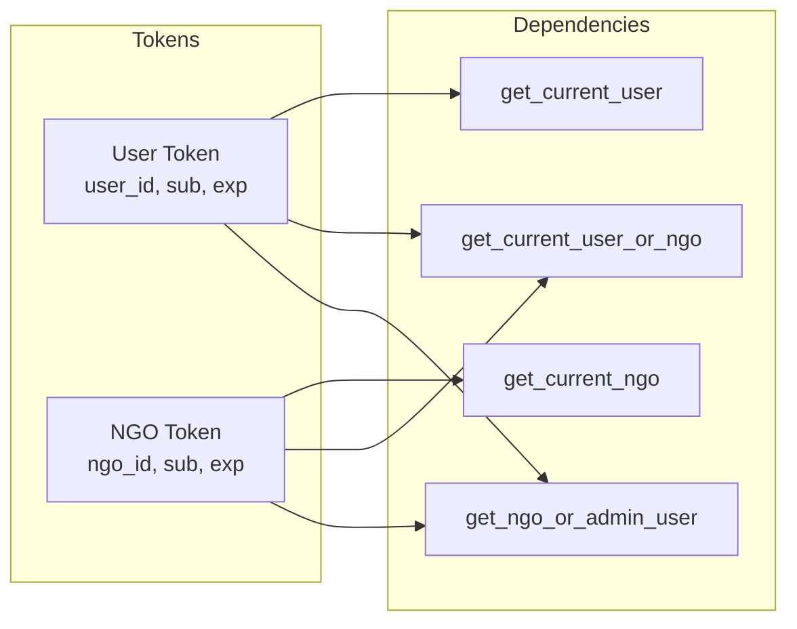

# Authentication

This document describes how authentication and authorization work in the Donation OpenHand backend.

## Overview

- **Mechanism:** JWT (JSON Web Tokens) in the `Authorization` header as `Bearer <token>`.
- **Two token types:** One for **users** (donors/admin), one for **NGOs**. A token carries either `user_id` or `ngo_id`, not both.
- **Passwords:** Hashed with **Argon2**; never stored in plain text.
- **Verification:** Users and NGOs must verify email before login; NGOs additionally require admin approval (`is_verified`).



---

## Token Creation

| Context | Function | Payload |
|---------|----------|---------|
| User login | `create_access_token(data={"sub": email, "user_id": id})` | `sub`, `user_id`, `exp` |
| NGO login | `create_access_token(data={"sub": email, "ngo_id": id})` | `sub`, `ngo_id`, `exp` |
| User email verify | `create_verification_token(user_id)` | `user_id`, `type: "verification"` (no exp) |
| NGO email verify | `create_ngo_verification_token(ngo_id)` | `ngo_id`, `type: "ngo_verification"` (no exp) |

- **Access tokens** use `SECRET_KEY` and `ALGORITHM` (HS256); expiry is configurable (e.g. 30 minutes).
- **Verification tokens** are used only in the verification link; they are not used for API auth.

**Implementation:** `app.services.authentication`.

---

## Dependency Injection (Who is logged in?)

All live in `app.dependencies.auth`:

| Dependency | Returns | Use case |
|------------|---------|----------|
| `get_current_user` | `User` | Routes that require a logged-in **user** (donor or admin). Rejects NGO tokens. |
| `get_current_ngo` | `NGO` | Routes that require a logged-in **NGO**. Rejects user tokens. |
| `get_current_user_or_ngo` | `(User \| None, NGO \| None)` | Pickups/payments: caller can be either user or NGO. |
| `get_ngo_or_admin_user` | `(User \| None, NGO \| None)` | Status updates: only NGO or admin user; one of the two is set. |
| `require_roles(*roles)` | Callable that returns `User` | Restricts to certain user roles (e.g. `require_roles(UserRole.DONOR, UserRole.ADMIN)`). |

**Header:** `Authorization: Bearer <access_token>`.

```mermaid
sequenceDiagram
    participant C as Client
    participant API as FastAPI
    participant Auth as Auth Dependency
    participant DB as Database

    C->>+API: Request + Authorization: Bearer &lt;token&gt;
    API->>+Auth: Extract & validate JWT
    alt Token invalid / expired
        Auth-->>API: 401 Unauthorized
        API-->>-C: 401
    else Token valid
        Auth->>DB: Load User or NGO by id
        alt User/NGO not found or not verified
            Auth-->>API: 401/403
            API-->>-C: 401/403
        else OK
            Auth-->>-API: User or NGO
            API->>API: Route handler
            API-->>-C: 200 + response
        end
    end
```

- If header missing or invalid format → **401 Unauthorized**.
- If token invalid/expired or user/NGO not found or not verified/not active → **401** or **403** as appropriate.

---

## Role-Based Access

- **User roles** (from `UserRole`): `donor`, `admin`.  
- **NGO** is not a “role” on User; NGOs have their own table and token.
- **Admin-only routes:** Use `require_roles(UserRole.ADMIN)` (e.g. all `/admin/*`).
- **Donor or Admin:** e.g. create pickup uses `require_roles(UserRole.DONOR, UserRole.ADMIN)`.
- **NGO or Admin:** Status update uses `get_ngo_or_admin_user` so either the assigned NGO or an admin can update.

---

## Verification and Blocking

- **User:** Must have `is_verified == True` to use access token; if `is_active == False`, requests are rejected (403).
- **NGO:** Must have `is_verified == True` (admin-approved) to use access token. Before that, they can only verify email (and get “pending approval” message).

**Donor vs NGO verification (two paths):**

```mermaid
flowchart TB
    subgraph DonorPath["Donor"]
        D1[Sign up]
        D2[Email with verify link]
        D3[Click link]
        D4[is_verified = true]
        D5[Can login]
        D1 --> D2 --> D3 --> D4 --> D5
    end
    subgraph NGOPath["NGO"]
        N1[Register]
        N2[Email with verify link]
        N3[Click link]
        N4[Admin notified]
        N5[Admin PATCH approve]
        N6[is_verified = true]
        N7[Can login]
        N1 --> N2 --> N3 --> N4 --> N5 --> N6 --> N7
    end
```



---

## Security Notes

- Use a strong `SECRET_KEY` in production and keep it secret.
- Verification tokens in DB are cleared after use.
- Passwords are never logged or returned in API responses.
- CORS is restricted to known frontend origins.
