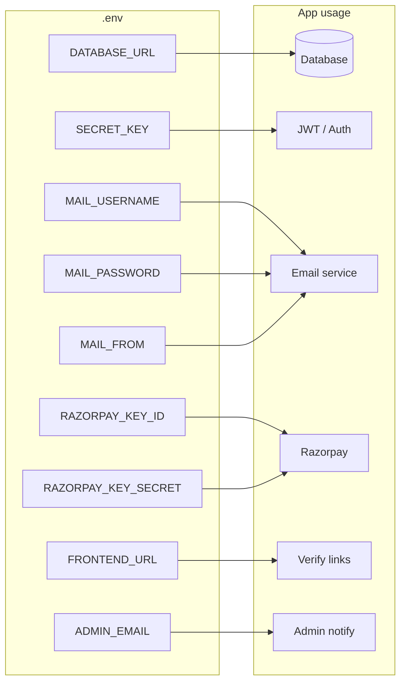

# Configuration

This document describes environment variables, local setup, and deployment-related configuration for the Donation OpenHand backend.

---

## Where configuration is used

---

## Environment Variables

Copy `.env.example` to `.env` in the **Backend** directory and fill in values. All are optional except where noted for the features you use.

| Variable | Required | Description | Example |
|----------|----------|-------------|---------|
| `DATABASE_URL` | No (default used) | Database connection URL | `sqlite:///./donation.db` or PostgreSQL URL |
| `SECRET_KEY` | Yes (for production) | JWT signing secret | Long random string |
| `MAIL_USERNAME` | For email | SMTP login (e.g. Gmail address) | `your@gmail.com` |
| `MAIL_PASSWORD` | For email | SMTP password (Gmail: use [App Password](https://support.google.com/accounts/answer/185833)) | 16-char app password |
| `MAIL_FROM` | For email | From address for outgoing mail | Same as MAIL_USERNAME |
| `FRONTEND_URL` | No | Base URL for verification/links in emails | `http://localhost:5173` |
| `ADMIN_EMAIL` | No | Email to notify when new NGO verifies (pending approval) | `admin@gmail.com` |
| `RAZORPAY_KEY_ID` | For real payments | Razorpay API key id | From Razorpay dashboard |
| `RAZORPAY_KEY_SECRET` | For real payments | Razorpay API secret | From Razorpay dashboard |
| `RAZORPAY_WEBHOOK_SECRET` | For webhooks | Secret to verify Razorpay webhook signature | From Razorpay webhook config |

**Notes:**

- If mail vars are missing or placeholders, verification and notification emails are skipped (logged only).
- If Razorpay keys are missing, pickup creation uses a **dummy** order and marks payment as paid so the flow works without real payments.

---

## Local Setup

1. **Python:** 3.12 recommended (e.g. `conda create -n dona python=3.12`).
2. **Install:**  
   `pip install -r requirements.txt`
3. **Configure:** Copy `Backend/.env.example` to `Backend/.env` and set at least `SECRET_KEY`. Set mail vars for verification emails; set Razorpay vars for real payments.
4. **Run:** From project root or Backend directory:  
   `uvicorn app.main:app --reload`  
   Default port: **8000**.

---

## Database

- **Default:** SQLite, file `donation.db` in the working directory (often project root if you run from there).
- **PostgreSQL:** Set `DATABASE_URL` to your Postgres connection string. Tables are created on startup.
- **Seeding:** On first run, a default admin user may be created (`admin@gmail.com` / `Admin@123`) and optional test NGOs if the NGO table is empty. Change default credentials in production.

---

## API Docs

- **Swagger UI:** `http://localhost:8000/docs`
- **ReDoc:** `http://localhost:8000/redoc`

---

## CORS

Allowed origins are set in `app/main.py` (e.g. `localhost:5173`, `localhost:3000`, `127.0.0.1`). For production, add your frontend origin and avoid wildcards.

---

## Production Checklist

- [ ] Set strong `SECRET_KEY`.
- [ ] Use a real database (e.g. PostgreSQL) and secure `DATABASE_URL`.
- [ ] Configure SMTP for verification and notification emails.
- [ ] If using Razorpay: set key/secret and webhook secret; configure webhook URL to `https://your-api/payments/webhook/razorpay`.
- [ ] Restrict CORS to your frontend domain(s).
- [ ] Turn off SQL echo in the engine (`echo=False` in `app/db/connection.py`).
- [ ] Serve over HTTPS and keep dependencies updated.
